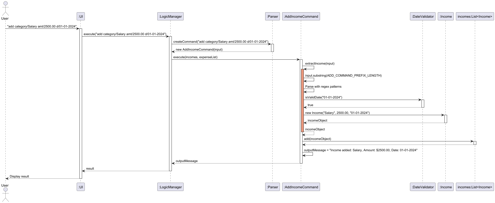
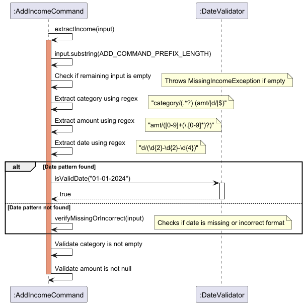

# Developer Guide
<br><br>
<br>

Anak Agung Gde Yogi Pramana<br>

Darius Lee Qi Lun<br>

Goh Yik Bing<br>

Nguyen Quy Dat<br>

Tran Hoang Thien Kim<br>

## Table of Contents
* [Introduction](#introduction)
* [Getting Started](#getting-started)<br>
  * [Prerequisites](#prerequisites)<br>
  * [Setting Up](#setting-up)<br>
* [Design](#design) <br>
  * [Architecture](#architecture) <br>
  * [UI](#ui) <br>
  * [Storage](#storage) <br>
  * [Logic](#logic) <br>
  * [Model](#model) <br>
    * [Expense](#expense) <br>
* [Implementation](#implementation) <br>
  * [Adding Income](#add) <br>
  * [Logging an Expense](#log-expense) <br>
  * [Viewing All Expenses](#view-all-expense) <br>
  * [Listing All Incomes](#list-income) <br>
  * [Filtering Incomes by Amount or by Category](#filter-income amount/date) <br>
  * [Deleting an Income Entry](#delete-income) <br>
  * [Updating an Expense Entry](#update-expense) <br>
  * [Comparing Expenses Between Two Months](#compare) <br>
  * [Deleting an Expense Entry](#delete-expense) <br>
  * [Exiting the Application](#exit) <br>
* [Documentation](#documentation) <br>
* [Testing](#testing)<br>
* [Appendix A. Product scope](#appendix-a-product-scope)<br>
* [Appendix B. User stories](#appendix-b-user-stories)<br>
* [Appendix C. Non-functional requirements](#appendix-c-non-functional-requirements)<br>
* [Appendix D. Instructions for manual testing](#appendix-d-instructions-for-manual-testing)

## Introduction

## Getting Started

### Prerequisites

### Setting Up

## Design
This section outlines the various components of the application and explains how they interact to execute the program.
### Architecture

### Command

### Storage
__API__:`Storage.java`
The `Storage` component can save the list of incomes and expenses data in .txt format and read it back.

### Logic

### Model

#### Expense
__API__: 

## Acknowledgements

{list here sources of all reused/adapted ideas, code, documentation, and third-party libraries -- include links to the original source as well}

## implementation

This section provides an overview of the implementation of key features.

### Adding Income

The ```AddIncomeCommand``` class handles the addition of income entries to the BudgetFlow application. This command parses user input in a specific format, extracts relevant information, validates it, and creates a new income record.

#### Command Format

Users add new income entries using the following command format:
```add category/<CATEGORY> amt/<AMOUNT> d/<DATE>```
Where:
```<CATEGORY>``` is the income category (e.g., "Salary", "Bonus")
```<AMOUNT>``` is the income amount as a decimal number
```<DATE>``` is the income date in DD-MM-YYYY format

#### Implementation
The ```AddIncomeCommand``` extends the abstract ```Command``` class and implements the command pattern for the BudgetFlow application.
##### Execution Process

Scenario: User keys in ```add category/Salary amt/2500.00 d/01-01-2024``` to the terminal.
When executed, the command:
1. User Input to Parser: The process begins with the User entering a command into the UI: ```add category/Salary amt/2500.00 d/01-01-2024```. Then, the UI component receives this input and forwards it to the Parser component by calling the method ```getCommandFromInput()``` with the user's text as a parameter. The Parser then checks if the input starts with ```add category/``` to determine what type of command it is.
   After validating the command type, the Parser creates a new ```AddIncomeCommand``` object using the input data and returns it to the UI.

2. Command Execution Initialization: The function ```execute(incomes, expenseList)``` is responsible for handling financial data, specifically income entries and an expense list. When called, it processes the incomes list, adding new income records.

3. Income Information Extraction: The function ```extractIncome(input)``` in ```AddIncomeCommand``` processes an input string to extract income details. It:
- Removes a command prefix and checks if the remaining input is empty (throws ```MissingIncomeException``` if empty).
- Uses regex to extract the category, amount, and date.
- If a date is found, it validates the date using ```DateValidator.isValidDate()```. If no valid date is found, it checks for missing or incorrect dates.
Finally, it validates that the category is not empty and the amount is not null.

4. Income Object Creation and Storage: The AddIncomeCommand creates a new Income object with the details "Salary", 2500.00, and "01-01-2024". The Income constructor is activated to instantiate the object, which is then returned to ```AddIncomeCommand```.
The ```AddIncomeCommand``` adds the newly created incomeObject to an IncomeList. The IncomeList's add() method is called, which is activated to insert the income into the list. The list then returns control to AddIncomeCommand.

5. Completion and Result Return: Illustrates how the success message is formatted and returned to the UI for display to the user.

6. 
#### Exception Handling

The `AddIncomeCommand` implements robust error handling through a series of custom exceptions:

| Exception | Cause | Error Message |
|-----------|-------|---------------|
| `MissingIncomeException` | Empty input after removing prefix | "Income should not be empty" |
| `MissingCategoryException` | Missing income category | "Error: Income category is required." |
| `MissingAmountException` | Missing income amount | "Error: Income amount is required." |
| `MissingDateException` | Missing income date | "Error: Income date is required." |
| `MissingDateException` | Invalid date format | "Error: Income date is in wrong format. Please use DD-MM-YYYY format." |
| `InvalidNumberFormatException` | Invalid amount format | When amount is not a valid number |

The command takes care to provide clear, actionable error messages to help users correct their input.

#### Design Considerations

##### Aspect: Parameter extraction approach

**Alternative 1 (current choice)**: Use regex pattern matching to extract parameters.
* Pros: Flexible order of parameters, robust extraction regardless of spacing or formatting variations.
* Cons: More complex implementation, potential regex performance concerns with very large inputs.

**Alternative 2**: Split by delimiters and process sequentially.
* Pros: Simpler implementation, potentially faster for simple inputs.
* Cons: Less flexible, requires strict ordering of parameters, more prone to errors with unusual formatting.

##### Aspect: Date validation strategy

**Alternative 1 (current choice)**: Use a separate DateValidator utility class.
* Pros: Reusable validation logic, separation of concerns.
* Cons: Additional dependency, potential overhead for simple validations.

**Alternative 2**: Inline date validation in the command.
* Pros: Self-contained, no additional dependencies.
* Cons: Code duplication if date validation is needed elsewhere, mixing validation logic
### Logging an Expense

This feature allows users to add expenses and relevant information about them (category, description, amount and date) to the expense list.

Here is an example of usage scenario:

Step 1: The user launches the application to log a spending to his expense list. The user executes
`log-expense category/Coffee desc/Coffee amt/3.50 d/06-03-2025` to add a new spending to the list.

Step 2: ...

...

### Viewing All Expenses

### Listing All Incomes

### Filtering Incomes by Amount or by Category

### Deleting an Income Entry

### Updating an Expense Entry

### Comparing Expenses Between Two Months

### Deleting an Expense Entry

### Exiting the Application

## Documentation

## Testing
JUnit is used for writing tests in this project. You can learn more about JUnit [here](https://se-education.org/guides/tutorials/gradle.html).
If you're using IntelliJ, you can run all tests by right-clicking the `test/java` folder and selecting `Run 'Tests'`, or by pressing `CRTL` + `SHIFT` + `F10`. 
Alternatively, you can open a console and run the command `gradelw clean test` (Mac/linus: `.gradlew clean test`).

###
{Describe the design and implementation of the product. Use UML diagrams and short code snippets where applicable.}


## Appendix A: Product scope
### Target User Profile
The Finance Tracker App is designed primarily for **students** who need a simple and efficient tool to manage their finances. The app is ideal for:
- **Primary Audience**: Undergraduate and graduate students who wish to track their expenses, income, and savings.
- **Demographics**: Primarily students aged 18-30, tech-savvy, who can type fast and prefer typing over other means of input.
- **User Needs**:
    - Track income and expenses easily.
    - Set and manage specific saving goals (e.g., saving for a trip or a new gadget).
    - View financial records by date or category for better budgeting.
    - Receive insights and reminders to manage finances effectively.
- **User Challenges**:
    - Lack of financial management knowledge.
    - Limited budget management skills.
    - Difficulty in tracking daily expenses or small amounts that add up.
    - Need for a simple, mobile-friendly solution to manage finances on-the-go.
### Value proposition

Budgetflow is designed to address financial management challenges faced by students. It
offers a solution tailored to their needs.This app simplifies personal finance management
through the following key benefits:

- **Financial Insights**:  
  Users gain visibility into their spending patterns from comparing monthly expenses.

By combining ease of use, goal-driven features, and actionable insights, Budgetflow empowers students to:
- Build better financial habits.
- Reduce stress around money management.
- Achieve their financial goals with confidence.

## Appendix B: User Stories

|Version| As a ... | I want to ...  | So that I can ...                                           |
|--------|----------|----------------|-------------------------------------------------------------|
| v1.0    | uni student | log my daily expenses     | track where my money is going                                  |
|v1.0|new user| see usage instructions | refer to them when I forget how to use the application      |
|v2.0|user| find a to-do item by name | locate a to-do without having to go through the entire list |
|v2.0|user| filter by date | which allocation to which category                          |
| v2.0    | user        | update my expenses        | make changes to the expenses I already added                   |

## Appendix C: Non-Functional Requirements

1. This application works on any computers that are Windows, macOS or Unix that has Java17.
## Glossary

* *glossary item* - Definition

## Appendix D: Instructions for manual testing

1. Launching
  * Download the jar file [here](insert git JAR file link here) and place it in an empty folder.
  * Open the command prompt and enter the command `java -jar tP.jar`.
  * Expected: The application shows a welcome message.

2. Adding expenses and incomes
  * Test case: `log-expense category/Coffee desc/Coffee amt/3.50 d/06-03-2025`
  * Expected: Confirmation message to indicate that the expense has been added successfully.
  * Test case: `add category/Salary amt/1000.00 d/06-03-2025`
  * Expected: Confirmation message to indicate that the income has been added successfully.

3. Editing expenses
  * Test case: `update-expense index/<index> category/drink desc/Coffee amt/4.00 d/06-04-2025` where `index` is the index of the expense list to be updated and `category`, `amt` and `d` are the category, amount and date to be changed to.
  * Expected: Confirmation message to indicate that the expense has been updated successfully.

